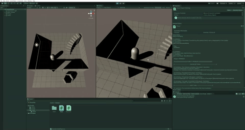
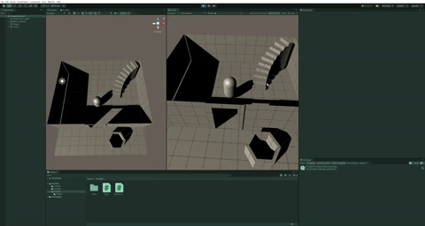

# State Machine
2 types of movement relative to a camera.
 
 This is the movement of the character constraint by the axis of the camera : 
 

This is the movement of the character, independent of the axis of the camera : 

